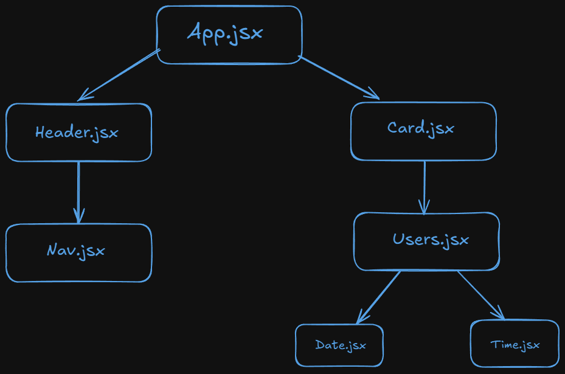

# Summary of the notes

- Props
- Conditional rendering

# Explanation

## props

- Props are named as short form of properties that are the arguments passed into react components
- They allow us to pass data from parent component to child components
- Props are passed to components via HTML attributes

- Example:-

  - App.jsx

  ```javascript
  const App = () => {
    return (
      <User
        img = "..."
        name = "Bobby"
        age = 14
        isMarried = false
      />
    )
  }
  ```

  - User.jsx

  ```javascript
  const User = ({ img, name, age, isMarried }) => {
    return (
      <div>
        
        <h1>{name}</h1>
        <h2> {age} </h2>
        <p> {isMarried} </p>
      </div>
    );
  };
  ```

- Here App is parent and User is child
- Generally we use props before in html but at that time we have no idea that those are props.
- Example:- when we use  we passed src and alt they are props

## Conditional rendering :-

- Conditional rendering allowsus to dynamically display different UI components or content based on specific conditions.
- This enables us to create more interactive and responsive user experience.
- We use conditional rendering in three types

  - if-else
  - ternary
  - Using &&
    > Most efficient ways are ternary and &&.
  - But there usage are different.

  - When we have to use either or then ternary is better.
  - When we have to use only if then && is better.

- Example:-

  - if-else:-

    ```javascript
    const ValidPassword = () => <h1>Valid</h1>;
    const InvalidPassword = () => <h1>Invalid</h1>;

    const Check = ({ isValid }) => {
      if (isValid) {
        return <ValidPassword />;
      } else {
        return <InvalidPassword />;
      }
    };
    ```

  - ternary :-

    ```javascript
    const ValidPassword = () => <h1> Valid </h1>;
    const InvalidPassword = () => <h1> Invalid </h1>;

    const Check = ({ isValid }) => {
      return isValid ? <ValidPassword /> : <InvalidPassword />;
    };
    ```

  - Using && :-

    ```javascript
    const ValidPassword = () => <h1> Valid </h1>;
    const InvalidPassword = () => <h1> Invalid </h1>;

    const Check = ({ isValid }) => {
      return isValid && <IsValid />;
    };
    ```

  ## Props drilling :-

  - Passing props from parent to children known as props drilling.
    
  - If I have a data in App.jsx then how can I use in Date.jsx
  - Passing from App => Card => User => Date
  - For a large dataset how can we pass like this

  - Example:-

  ```javascript
  <!-- App.jsx -->
  import React from 'react'
  import CompoA from './components/CompoA'

  const App = () => {
    const myName = 'Priyansu'
    return (
      <div>
        <CompoA name={myName}/>
      </div>
    )
  }

  export default App
  ```

  ```javascript
  <!-- CompoA.jsx -->
  import React from 'react'
  import CompoB from './CompoB'

  const CompoA = ({name}) => {
    return (
      <div>
        <CompoB name= {name}/>
      </div>
    )
  }

  export default CompoA
  ```

  ```javascript
  <!-- CompoB.jsx -->
  import React from 'react'
  import CompoC from './CompoC'

  const CompoB = ({name}) => {
    return (
      <div>
        <CompoC name={name}/>
      </div>
    )
  }

  export default CompoB
  ```

  ```javascript
  import React from "react";

  const CompoC = ({ name }) => {
    return <div>My Name: {name}</div>;
  };

  export default CompoC;
  ```

  - Here we pass data from App to CompoC

  > When there will be deeply element, it will be nightmare for a developer when using props drilling. so we have a hook called useContext.
